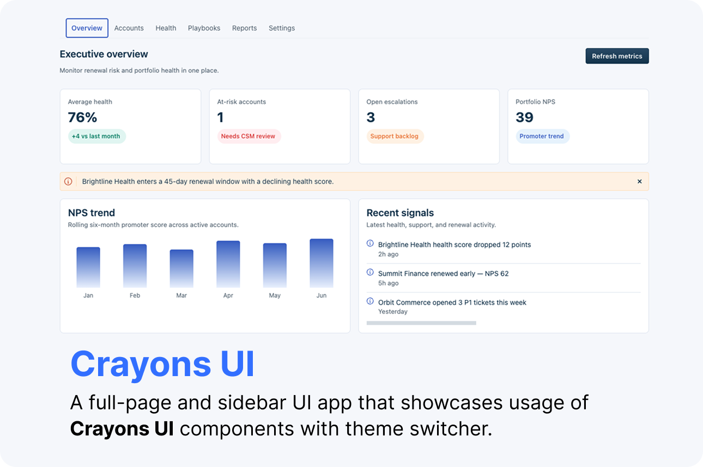
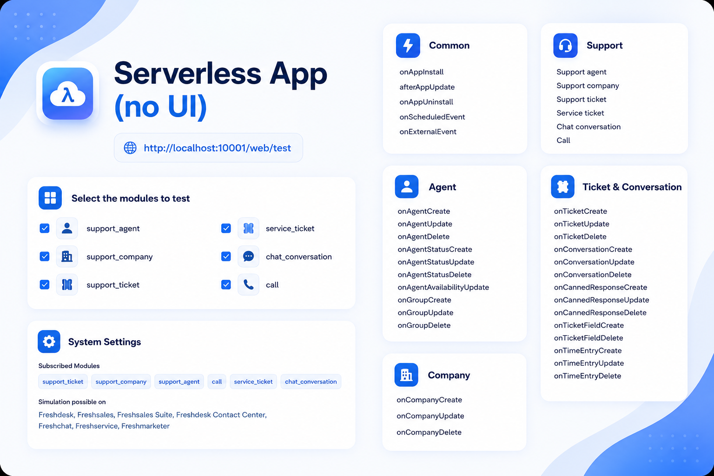

<p align="center">
  
</p>


# PulseOps — Crayons v4 React Meta Sample

Global Freshworks **Platform 3.0** reference app that demonstrates every **Crayons v4 React** component inside a realistic B2B customer success product — not a component gallery.



| | |
|---|---|
| **Platform** | 3.0 global app (React Meta) |
| **Primary surface** | Full-page analytics dashboard |
| **Products** | Freshdesk + Freshservice from one manifest |
| **UI** | `@freshworks/crayons` v4 via npm — no Tailwind |
| **Node** | 24.11.1 |
| **FDK** | 10.1.2 |

---

## What it does

**PulseOps** helps customer success leaders monitor account health, churn risk, NPS/CSAT, and support load across a SaaS portfolio. Every Crayons component appears as part of real workflows — KPI cards, account tables, playbook editors, ticket sidebars — never as isolated demos or code snippets.

Use it to:

1. **Learn React Meta** — multi-entry placeholders, shared `PlaceholderWrapper`, router only in full page.
2. **Explore Crayons v4** — all React exports from `@freshworks/crayons/react` embedded in production-style UI.
3. **Validate coverage** — `npm test` asserts every Crayons component and controller is referenced in source.

Personas and workflows: [usecase.md](./usecase.md). Crayons design system: [crayons.freshworks.com](https://crayons.freshworks.com/).

---

## Surfaces

| Placeholder | Module | PulseOps story |
|-------------|--------|----------------|
| **Full page app** | `common` | Portfolio dashboard — Overview, Accounts, Health, Playbooks, Reports, Settings |
| **CTI global sidebar** | `common` | Voice queue stats for support leadership |
| **Ticket sidebar** | `support_ticket` | Account health + renewal risk while resolving tickets |
| **Ticket top navigation** | `support_ticket` | At-risk account banner on ticket page |
| **Contact sidebar** | `support_contact` | CSM touchpoint notes and NPS history |
| **Company background** | `support_company` | Account tier, seats, usage vs plan |
| **Ticket sidebar (FS)** | `service_ticket` | Minimal Freshservice install stub |

---

## Dashboard views

| Route | View | Key Crayons usage |
|-------|------|-------------------|
| `/` | Overview | KPI strip, inline alerts, activity feed, toast on refresh |
| `/accounts` | Accounts | DataTable, custom cells, filters, pagination, kebab menu |
| `/health` | Health | Segment tabs, accordion drill-down, popover definitions |
| `/playbooks` | Playbooks | Drag reorder, modal editor, form controls |
| `/reports` | Reports | File upload (legacy + v2), export files |
| `/settings` | Settings | Theme picker (Light / Dark / Midnight), notifications, regional routing |

**Themes:** Light, Dark, and Pulse midnight — persisted via `client.db.set('pulseops_theme')`.

---

## Prerequisites

| Requirement | Link |
|-------------|------|
| **Node.js 24.x** | [nodejs.org](https://nodejs.org/) |
| **FDK 10.1.2** | [Freshworks CLI setup](https://developers.freshworks.com/docs/app-sdk/v3.0/common/freshworks-cli-setup/) |
| **Chrome (latest)** | Required for local app preview |
| **Dev account** | Freshdesk and/or Freshservice |

Enable global apps before validating:

```bash
fdk config set global_apps.enabled true
```

---

## Step 1 — Install and validate

```bash
cd usecase+migration/crayons-samples
npm install
fdk validate
npm test
```

Expected: **0 platform errors**, **0 lint errors**, all Crayons coverage tests passing.

---

## Step 2 — Run locally

```bash
fdk run
```

1. Open **System Settings** → enable **Freshdesk** and **Freshservice** modules.
2. Install the app on your dev account.
3. Open each placeholder from the product UI, or use the full-page URL with `?dev=true`.

---

## Project structure

```text
crayons-samples/
├── manifest.json              # Global app — React Meta
├── app/
│   ├── index.html             # Full-page entry
│   ├── *Sidebar.html          # One HTML shell per placeholder
│   ├── components/
│   │   ├── index.jsx          # Full-page bootstrap
│   │   ├── App.jsx            # React Router
│   │   ├── dashboard/         # Six analytics views
│   │   ├── layout/            # DashboardShell, TopBar
│   │   └── placeholders/      # Sidebar/top-nav surfaces
│   ├── context/ThemeContext.jsx
│   ├── data/mockData.js
│   └── styles/                # Crayons utilities + theme CSS only
├── tests/crayons-coverage.test.js
├── README.md
└── usecase.md
```

---

## Styling approach

This sample intentionally uses **Crayons only** — no Tailwind, PostCSS plugins, or third-party UI libraries.

| Source | Purpose |
|--------|---------|
| `@freshworks/crayons/css/crayons-min.css` | Base design tokens and component styles |
| Crayons layout utilities | `fw-flex`, `fw-gap-*`, `fw-m-*`, `fw-type-h*` |
| Crayons components | Structure via Tabs, DataTable, Modal, etc. |
| `themes.css` | Light / Dark / Midnight CSS variables on `[data-theme]` |

---

## Related samples

| Sample | Focus |
|--------|-------|
| [superstack](../superstack/) | Multi-placeholder architecture with SMI + OAuth |
| [serverless-app-samples](../serverless-app-samples/) | All serverless events and patterns |
| [oauth-samples](../oauth-samples/) | OAuth + React Meta |

---

## License

See repository root for license terms.
